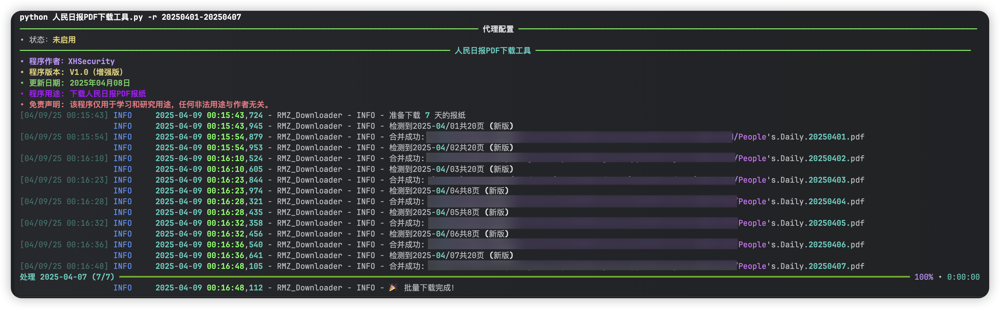
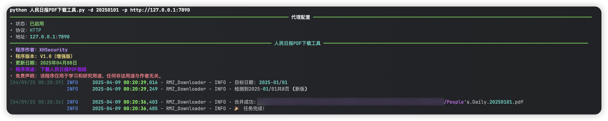

# 人民日报PDF下载工具

## People's Daily PDF Downloader

免责声明：该程序仅用于学习和研究用途，任何非法用途与作者无关。

### 1.安装依赖
``` pip install pymupdf requests rich ```

### 2.运行程序
``` python 人民日报PDF下载工具.py ```

### 3.程序运行
使用说明
``` python 人民日报PDF下载工具.py -h ```


单日下载
``` python 人民日报PDF下载工具.py -d 20250408 ```


批量下载
``` python 人民日报PDF下载工具.py -r 20250401-20250407 ```


设置代理
``` python 人民日报PDF下载工具.py -d 20250101 -p http://127.0.0.1:7890 ```

